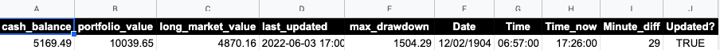

# Dashboard README.md

Status: In progress

# AlgoQuant Dashboard

# Motivation

The dashboard is hosted on Google Data Studio to display the key metrics and figures of a trading portfolio account. A bot is running 24/7 on cloud and the performance of the bot can be accessed and evaluated through the dashboard.

# Demo / Screenshots

- [Dashboard link](https://datastudio.google.com/s/olg3z5e2JEI)
- [Database link](https://docs.google.com/spreadsheets/d/1hPxsuwdDvpZpQYG2yi_djwcDG1RDAw1RcS-QZ5prUPo/edit?usp=sharing)
- Screenshot
    - Google Data Studio
        
        
        
        
        
    - Google Sheets
        
        
        
        
        
        
        

# Built with

- Python
- Google Sheets
- Google Data Studio
- Cron

# Features

- Auto updates every 30minutes (requires local machine to be on)
- ETL workflow adapted
- Seamless workflow from extracting data, transforming data and loading data into Google Sheets as temporary database before visualizing it using Google Data Studio
- Monitor the cron job using Cronitor and alerts will be sent to the email if the automation fails.

# Installation?

Clone the source locally:

```sql
$ git clone 
$ cd AlgoQuant_dashboard
```

Install project dependencies:

```sql
pip install requirements.txt
```

Start the project:

```sql
$ python src/main.py
```

# Explanation of the workflow

1. Portfolio details and data are extracted from alpaca using SDK through a python library, **alpaca_trade_api**. 
    
    Note:
    
- The account used is a paper trading account so no real money is involved in this project.
- One has to create and apply an alpaca paper trading account through their official website in order to get the personal API token and API secret token
- API token, secret token and base_url have to be stored as environment variables.
- **Hydra** library was used to access the token values stored in the `main.yaml` under the config folder.
1. After establishing connection with alpaca, account details, current portfolio values and metrics, and also time-series data of the portfolio changes are extracted using the library. (Extract)
2. Some data wrangling and data manipulation are applied in order to structure and transform the data into clean data before feeding into the dashboard for visualizing. (Transform)
3. After transforming the data, the latest data will be load into the **Google Sheets** where the spreadsheet will acts as a database. (Load)
4. Finally, the data are queried from the spreadsheets and visualized in the **Google Data Studio**.
5. Local **cron** job has been set to update the dashboard by running the python script every 30mins. **Cronitor** is also set up to monitor the automation and email alerts will be sent to the email when the automation fails (i.e. local machine is shut down)

## Directory break down:

- credentials
    - stored service file for google sheets authentication
- config
    - `main.yaml`
        - store environment variables and credentials such as alpaca API token
- logs
    - `cron.txt`
        - log files for the cron job’s output
- notebooks
    - `Playground.ipynb`
        - Notebook for testing functions and features
- src
    - directory where all the main scripts are stored
- requirements.txt
    - list of python libraries that was needed for the project

# License

MIT ©️  [Samuel](https://github.com/chunyip135)
